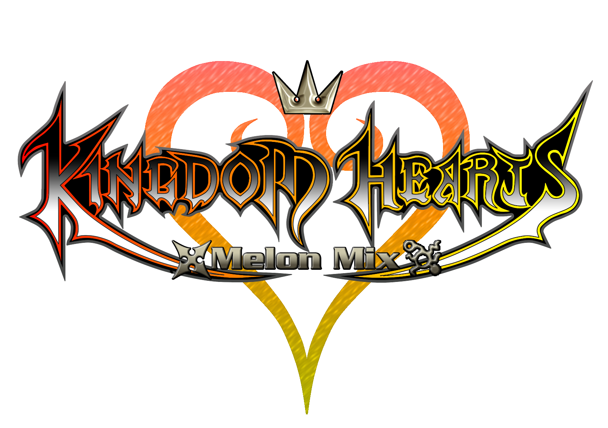

<h4 align="center"><i>Logo by JackSilverson</i></h4>

melonDS, sorta

This project aims to turn the Kingdom Hearts DS games into playable PC games with a single screen and controls suited for a regular controller.

This is a version of melonDS with some modifications made specifically to improve those specific games experience. Any issues you have with KH Melon Mix should be reported in this same repository, and not in melonDS repository.

Join our [Discord](https://discord.gg/dQZx65QUnE) to keep in touch with the latest updates and/or to help with the project.

## How to play "Kingdom Hearts 358/2 Days"

1. Download the [latest version](https://github.com/vitor251093/KHMelonMix/releases/latest) for your system (not the source code zip);
2. Open the downloaded ZIP file and copy the contents to an empty folder;
3. Dump an original copy of "Kingdom Hearts 358/2 Days" and copy the NDS file to your computer;
4. Rename that NDS file to "days.nds", place it inside a folder named "roms", and then place that folder next to the Melon Mix executable that you just copied;
5. Replace the assets folder with [this assets folder](https://mega.nz/folder/lpgykK5Y#HPJuOSceHSzncDjQh0DUtw) (this step is only required if you want to replace the DS cutscenes with HD cutscenes);
6. Now you just need to launch the Melon Mix using "MelonMix_KHDays.bat" (or MelonMix_KHDays.sh if you are not on Windows).

## How to play "Kingdom Hearts Re:Coded"

1. Download the [latest version](https://github.com/vitor251093/KHMelonMix/releases/latest) for your system (not the source code zip);
2. Open the downloaded ZIP file and copy the contents to an empty folder;
3. Dump an original copy of "Kingdom Hearts Re:Coded" and copy the NDS file to your computer;
4. Rename that NDS file to "recoded.nds", place it inside a folder named "roms", and then place that folder next to the Melon Mix executable that you just copied;
5. Now you just need to launch the Melon Mix using "MelonMix_KHReCoded.bat" (or MelonMix_KHReCoded.sh if you are not on Windows).

### Recommended Controller Binds
* (DS Keypad tab) Map the DS D-Pad to your controller's left analog stick
* (DS Keypad tab) Map the Select/Start buttons to the equivalent keys in your controller
* (DS Keypad tab) Map the A/B/X/Y buttons to the equivalent keys in your controller
* (DS Keypad tab) Map the L button to the L1/LB button in your controller
* (Touch Screen tab) Map the DS Touch Screen to your controller's right analog stick
* (Add-ons tab) Map the command menu to your controller's D-Pad
* (Add-ons tab) Map the L2 button to the L2/LT button in your controller
* (Add-ons tab) Map R1 and R2 to the R1/RB and R2/RL buttons in your controller
* (Add-ons tab) Map the HUD Toggle to an available button of your preference
* (General hotkeys) Map Toggle fullscreen to an available button of your preference

### Steam Deck
The AppImage build is compatible with the Steam Deck. In order to use it, download the AppImage build, extract the zip, right click the AppImage and go to "Properties". Then go to the "Permissions" tab and check the "Allow executing file as program" checkbox. Don't forget the NDS file, like mentioned above.

<i>Kingdom Hearts 358/2 Days - Melon Mix v0.2.2</i>

## How to build from scratch
See [BUILD.md](./BUILD.md) for build instructions.

## Credits

 * All people that supported and developed [melonDS](https://github.com/melonDS-emu/melonDS) (seriously, support them if possible; this project wouldn't exist without melonDS)
 * Logo of the project by JackSilverson
 * Logo of Days Melon Mix and ReCoded Melon Mix by DiabeticMedic
 * sandwichwater and DaniKH, for the innumerous amount of tests and for the hi-res textures
 * All the members from our Discord server that helped testing and developing the Melon Mix!
 * Michael Lipinski, for the [documentation](https://pdfs.semanticscholar.org/657d/adf4888f6302701095055b0d7a066e42b36f.pdf) regarding the way a NDS works
 * Datel Design & Development Ltd, for the [documentation](https://uk.codejunkies.com/support_downloads/Trainer-Toolkit-for-Nintendo-DS-User-Manual.pdf) regarding how to write AR Codes

## Licenses

KH Melon Mix is free software: you can redistribute it and/or modify
it under the terms of the GNU General Public License as published by
the Free Software Foundation, either version 3 of the License, or
(at your option) any later version.

### External
* Images used in the Input Config Dialog - see `src/frontend/qt_sdl/InputConfig/resources/LICENSE.md`
